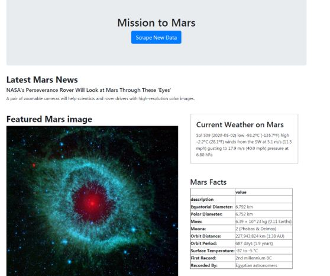
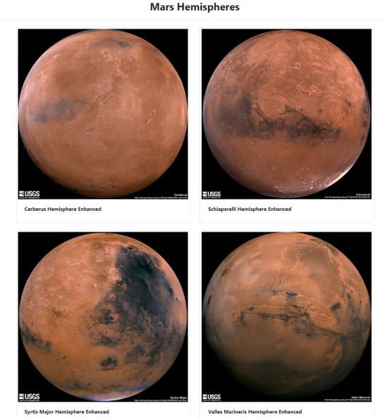

# Mission to Mars

<h3>Objective:</h3>
To build a web application that scrapes various websites for data related to the Mission to Mars and displays the information in a single HTML page.

<h3>Data Sources:</h3> 

1. <strong>NASA Mars News:</strong> https://mars.nasa.gov
2. https://www.jpl.nasa.gov/spaceimages/?search=&category=Mars
3. https://twitter.com/marswxreport?lang=en
4. https://space-facts.com/mars 
5. https://astrogeology.usgs.gov/search/results?q=hemisphere+enhanced&k1=target&v1=Mars

Beautiful soup was used to scrape the above websites for latest news headline and snippet, featured image, latest weather tweet, fact table and hemisphere images respectively.
The scrapped data was then stored in MongoDB and was rendered onto the HTML page using flask app. 
A user interactive button was provided on the page which on clicking would scrape the latest information and render it on the page.  
  

